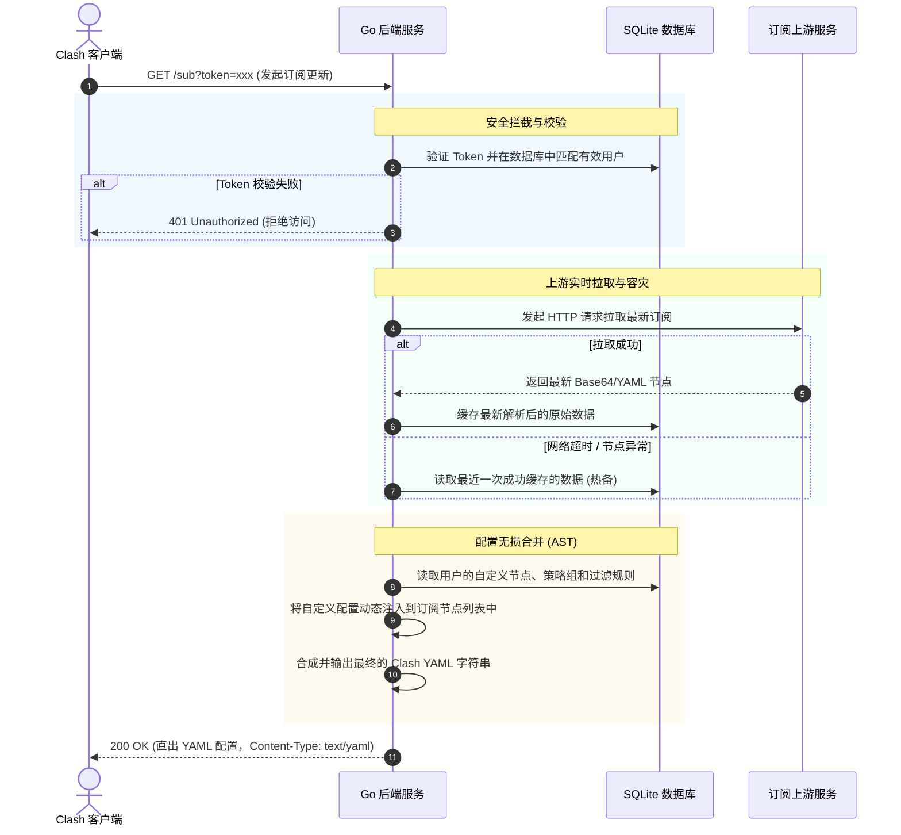

# Clash Proxy 订阅定制与安全动态分发平台

<p align="center">
  
  
  
  
  
</p>

`clash-proxy` 是一个专为 Clash/Mihomo 客户端量身定制的**订阅解析、自定义合并与安全动态分发平台**。

传统的在线订阅转换服务存在巨大的隐私泄漏隐患，且无法持久化保存个性化配置。本项目旨在提供一个**私有化部署、安全可控、无损动态合成**的终极解决方案。

---

## 🌟 核心特性

- 🔒 **防泄漏 Token 鉴权**  
  订阅地址集成安全 Token 鉴权（包含生成账户、时间戳及强随机盐）。采用**唯一有效性机制**：每次生成新订阅链接时，旧 Token 立即永久作废，保障订阅绝对安全。
- ⚡ **无损动态合成 (AST 解析)**  
  当客户端请求订阅链接时，后端会**实时从上游刷新拉取最新节点**，随后与您保存在本地数据库中的“自定义节点”、“个性化策略组”及“自定义分流规则”进行无损动态融合，输出最终的 YAML 配置文件。
- 🛡️ **上游故障热备 (断连容灾)**  
  如果上游原始订阅服务器因网络波动暂时无法连接，系统将**自动退避使用最近一次成功解析的历史缓存**进行合成直出，确保您的代理软件始终能拉取配置，绝不断网。
- 🎨 **高颜值控制面板**  
  使用 **Vue 3 + Vite + Element Plus** 构建的现代化仪表盘。支持节点展示、代理和分流规则的可视化管理，集成一键生成并复制订阅链接的安全弹窗。

---

## 🏗️ 架构与工作流

本系统由前端管理后台与高并发 Go 后端组成，两部分通过 RESTful API 进行无缝通讯。



---

## 🛠️ 技术栈

- **前端 (Frontend)**:
  - 核心框架: Vue 3 (Composition API)
  - 构建工具: Vite
  - 语言: TypeScript
  - 状态管理: Pinia
  - UI 库: Element Plus
  - 网络请求: Axios

- **后端 (Backend)**:
  - 开发语言: Go 1.20+
  - Web 框架: Gin
  - 数据库 ORM: GORM (SQLite 3 驱动)
  - 热重载工具: Air

---

## 🚀 快速上手

### 1. 克隆项目与环境准备
确保您的本地已安装 [Node.js (16+)](https://nodejs.org/) 和 [Go (1.20+)](https://go.dev/) 环境。

```bash
git clone https://github.com/mangobubu/clash_proxy.git
cd clash_proxy
```

### 2. 后端服务部署
后端数据库使用 SQLite 3，无需安装独立的数据库软件，启动时会自动在 `backend` 目录下创建 `gorm.db`。

```bash
cd backend
# 下载依赖
go mod tidy

# 方式 A：开发环境下使用 Air 实时重载运行
# （需先全局安装 air: go install github.com/air-verse/air@latest）
air

# 方式 B：直接用 Go 编译或运行
go run main.go
```
后端服务默认监听端口：`http://localhost:8080`

### 3. 前端服务部署
```bash
cd ../frontend

# 安装 pnpm (如已安装可跳过)
npm install -g pnpm

# 安装依赖
pnpm install

# 运行前端开发服务器
pnpm dev
```
前端服务默认运行于：`http://localhost:5173`。前端已配置了 Vite 反向代理，会自动将 `/api` 的请求转发至后端的 `http://localhost:8080/api`。

### 4. 生产环境构建

#### 前端构建
在前端目录下运行以下命令，将静态资源打包成高效的生产包：
```bash
cd frontend
pnpm build
```
打包完成后会在 `frontend` 目录下生成 `dist` 文件夹，该文件夹可直接使用 Nginx 等 Web 服务器进行静态托管。

#### 后端构建
在后端目录下运行以下命令，将 Go 项目编译成单个高并发的可执行二进制文件：
```bash
cd backend
# 编译生成可执行文件 (Windows 环境下会自动生成 clash-proxy.exe)
go build -o clash-proxy

# 运行可执行二进制文件
./clash-proxy
```
编译成功后，在生产服务器上仅需携带生成的二进制文件与同级目录下的 `gorm.db`（若存在）即可运行服务。

---

## 📖 使用指南

1. **注册与登录**  
   首次使用时，在登录页面输入用户名和密码即可自动完成注册并登录。
2. **导入原始订阅**  
   在后台中配置您的上游订阅地址，系统将自动对其进行拉取和解码，并展示其中的节点列表。
3. **定制个性化配置**  
   - 可在界面中添加专属的**自定义节点**。
   - 配置您喜好的**分流规则**（如：直连、全局代理、中国IP直连、广告拦截等）。
4. **生成安全订阅**  
   - 在主界面点击亮眼的 **[生成最终订阅]** 按钮。
   - 系统将弹窗显示一个附带专属 `token` 参数的安全链接（例如 `http://localhost:8080/sub?token=xxx`）。
   - 点击 **[一键复制]** 并粘贴到您的代理客户端（如 Clash Verge, Mihomo Party, Clash for Windows 等）中即可。
   - **注意**：如果未来点击了“重新生成”，旧的链接会当即失效，防止订阅链接泄露后的不可控风险。

---

## 📄 开源协议

本项目基于 **MIT License** 开源。详情参见 [LICENSE](LICENSE) 文件。
