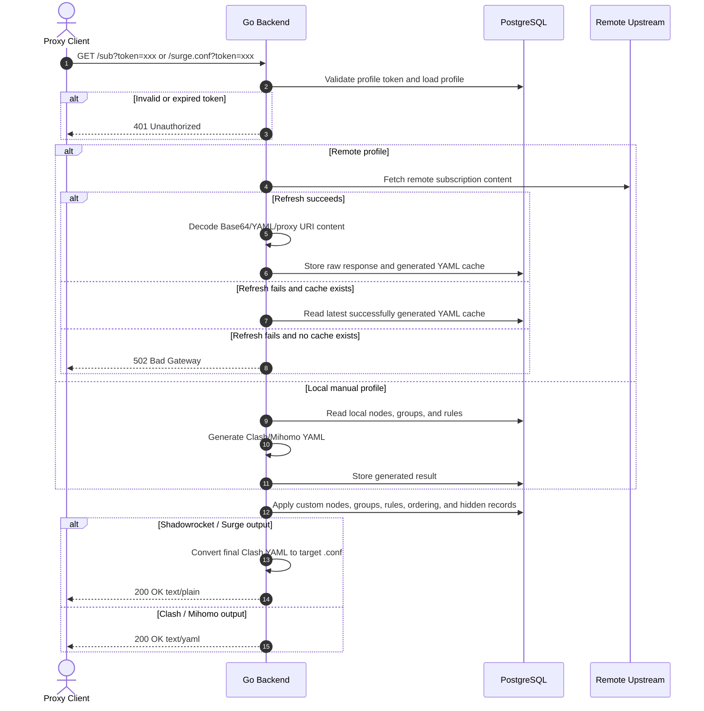

# ClashSubAST - Subscription Customization & Secure Distribution Platform

<p align="center">
  
  
  
  
  
</p>

`ClashSubAST` is a self-hosted subscription management platform for Clash/Mihomo, Surge, and Shadowrocket. It brings remote subscriptions, local manual profiles, custom nodes, proxy groups, routing rules, and multi-client output formats into one visual dashboard. It is designed for users who need to maintain multiple proxy configurations over time while reducing subscription link leakage risk.

Traditional online subscription converters rarely preserve personalized configuration and require exposing subscription content to third-party services. This project focuses on storing configuration in your own environment, generating secure profile-specific subscription links, and keeping the last usable output available when refreshes fail.

---

## 🌟 Core Features

- 🔒 **Profile-Level Token Authentication**
  Each subscription profile has its own token. Regenerating a token immediately invalidates the old URL. Copying a subscription URL only reads the current token and does not overwrite it.

- 🧩 **Structured YAML Merge & Local Takeover**
  The backend uses `yaml.v3` node trees to process Clash/Mihomo YAML, then reapplies custom nodes, proxy groups, rules, ordering, and hidden subscription resources. Subscription resources can be taken over as local resources and maintained independently per profile.

- 🔄 **Remote Refresh With Cached Fallback**
  Remote profiles try to fetch the upstream subscription and update the cache when refreshed or requested by a client. If the upstream source is unavailable and a previous generated result exists, the server returns the latest cached output. Local manual profiles do not request upstream sources; they generate YAML from manually maintained nodes, groups, and rules.

- 🗂️ **Multi-Profile Isolation**
  Create multiple remote or local profiles. Nodes, groups, rules, resource ordering, hidden records, and subscription tokens are isolated per profile, making it practical to maintain different clients or routing strategies.

- 📲 **Multi-Client Subscription Output**
  One profile can output Clash/Mihomo YAML, Surge latest configuration, Surge 5.7.6 compatible configuration, Shadowrocket configuration, and a Shadowrocket install entry.

- 🎛️ **Visual Control Panel**
  The frontend is built with Vue 3, Vite, Element Plus, and CodeMirror. It supports subscription previews, proxy link parsing, resource drag sorting, batch rule save/delete, cross-profile group and rule copy, remote rule localization, backup, and import.

---

## 🏗️ Architecture & Workflow



---

## 🛠️ Technology Stack

- **Frontend**
  - Vue 3 + TypeScript
  - Vite
  - Element Plus
  - Axios
  - CodeMirror YAML editor
  - js-yaml

- **Backend**
  - Go 1.26+
  - Gin
  - GORM
  - PostgreSQL
  - `gopkg.in/yaml.v3`
  - base64Captcha

---

## 🚀 Quick Start

### 1. Prerequisites

Prepare the following first:

- [Go 1.26+](https://go.dev/)
- [Node.js 20+](https://nodejs.org/)
- PostgreSQL database
- `pnpm` or `npm`

```bash
git clone https://github.com/mangobubu/clash_proxy.git
cd clash_proxy
```

### 2. Backend Configuration & Run

The backend reads `config.toml` from its current working directory. In development, the backend is usually run from the `backend` directory, so copy the template and fill in your PostgreSQL connection first:

```bash
cd backend
cp config.example.toml config.toml
```

Key options:

```toml
[server]
port = 8080

[database]
host = "127.0.0.1"
user = "your_username"
password = "your_password"
dbname = "clash_proxy"
port = 5432
sslmode = "disable"
timezone = "Asia/Shanghai"

[auth]
captcha_enabled = true
```

Run the development backend:

```bash
go mod tidy
go run main.go
```

The backend listens on `http://localhost:8080` by default.

### 3. Frontend Development

```bash
cd ../frontend
pnpm install
pnpm dev
```

If `pnpm` is not installed, use `npm install` and `npm run dev`. The frontend development server runs at `http://localhost:5173` by default and accesses backend `/api` routes through the Vite proxy.

---

## 📦 Production Build

The project root contains a Go-based build script:

```bash
go run build.go
```

The build script will:

- Detect and use `pnpm`, falling back to `npm` when needed
- Install frontend dependencies
- Build frontend production assets
- Compile the backend binary
- Collect runtime artifacts into the root `release` directory
- Generate `release/config.toml` from `backend/config.example.toml` on the first build without overwriting it on later builds

Output layout:

```text
release/
├── ClashSubAST         # ClashSubAST.exe on Windows
└── config.toml         # Runtime configuration
```

Run the binary from inside the `release` directory. Make sure the PostgreSQL connection in `config.toml` is correct.

---

## 📖 User Guide

1. **Initialize Administrator**
   On the first visit, the console enters initialization mode. Create an administrator account, then log in with it. Captcha can be enabled or disabled through the `[auth]` section in `config.toml`.

2. **Create Profiles**
   Two profile types are supported:
   - **Remote subscription**: provide an upstream subscription URL. The backend fetches, decodes, and generates final Clash/Mihomo YAML when refreshed.
   - **Local manual**: no upstream URL is required. Nodes, groups, and rules are maintained directly in the dashboard.

3. **Maintain Nodes, Groups, and Rules**
   Add custom nodes, parse proxy links, edit proxy groups, maintain routing rules, batch save rules, batch delete rules, and take over subscription nodes or groups as local resources.

4. **Sort and Hide Subscription Resources**
   Nodes and groups support drag sorting. Deleting a subscription resource records it as hidden, so it will not automatically return after refresh. Taken-over resources are managed as local custom resources.

5. **Reuse Across Profiles**
   Copy proxy groups or rules from other profiles, or localize rules from a remote subscription so they can be maintained directly in the current profile.

6. **Generate Subscription URLs**
   Each profile can regenerate its own token. The subscription dialog provides:
   - Clash / Mihomo YAML: `/sub?token=xxx`
   - Surge latest: `/surge.conf?token=xxx`
   - Surge 5.7.6: `/surge-5.7.6.conf?token=xxx`
   - Shadowrocket config: `/shadowrocket.conf?token=xxx`
   - Shadowrocket install entry: `/shadowrocket/install?token=xxx`

7. **Backup and Import**
   The console supports exporting data backups and importing backup JSON files. If an import fails, the backend rolls back the database transaction.

---

## 🐳 Docker Compose Deployment

The current `docker-compose.yml` targets a production environment with an existing PostgreSQL database and an existing external Docker network. Before use, update these values for your environment:

- `DB_HOST`
- `DB_USER`
- `DB_PASSWORD`
- `DB_NAME`
- `DB_PORT`
- `DB_SSLMODE`
- `DB_TIMEZONE`
- `SERVER_PORT`
- `networks.1panel-network.external`

Start the service:

```bash
docker compose up -d
```

Common management commands:

```bash
docker compose ps
docker compose logs -f
docker compose down
docker compose up -d --build
```

Note: the current Compose file does not create a PostgreSQL container or the external network automatically. Ensure both are available first, or adjust the Compose file for your deployment environment.

---

## 📄 License

This project is licensed under the **MIT License**. See the [LICENSE](LICENSE) file for details.
