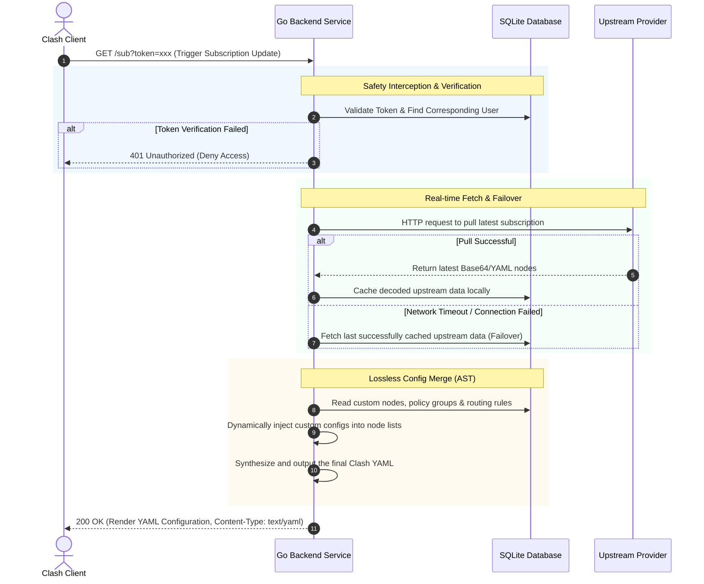

# ClashSubAST - Subscription Customization & Secure Dynamic Distribution Platform

<p align="center">
  
  
  
  
  
</p>

`ClashSubAST` is a specialized **subscription parsing, custom merging, and secure dynamic distribution platform** designed specifically for Clash/Mihomo clients.

Traditional online subscription conversion services pose severe privacy leakage risks and lack the capability to save personalized configurations persistently. This project aims to offer a **privately deployed, secure, and losslessly dynamically synthesized** ultimate solution.

---

## 🌟 Core Features

- 🔒 **Privacy-Preserving Token Authentication**  
  The generated subscription link integrates secure Token authentication (consisting of the generation user, timestamp, and a cryptographically strong random salt). Adheres to the **Sole-Validity Mechanism**: whenever a new subscription link is generated, the older Token is permanently revoked immediately, protecting your subscription from unauthorized access.
- ⚡ **Lossless Dynamic Synthesis (AST Parsing)**  
  When a client requests a subscription link, the backend **refreshes and fetches the upstream subscription in real time**. It then seamlessly merges these nodes with your custom nodes, strategic groups, and personalized rules stored in the local database to compose and output the final Clash YAML config.
- 🛡️ **Upstream Failover & Disaster Recovery**  
  If the upstream subscription server is temporarily unreachable due to network fluctuations, the system **automatically falls back to using the last successfully cached historical subscription** to complete the synthesis, ensuring that your proxy software never loses internet connectivity.
- 🎨 **Beautiful Web Control Panel**  
  A modern, elegant dashboard built using **Vue 3 + Vite + Element Plus**. Supports visual management of nodes, proxies, and custom split-routing rules, integrated with a high-fidelity popup for one-click secure subscription link generation and copying.

---

## 🏗️ Architecture & Workflow

The system is composed of an administration frontend and a highly concurrent Go backend communicating seamlessly via RESTful APIs.



---

## 🛠️ Technology Stack

- **Frontend**:
  - Core Framework: Vue 3 (Composition API)
  - Build Tool: Vite
  - Programming Language: TypeScript
  - State Management: Pinia
  - UI Library: Element Plus
  - HTTP Client: Axios

- **Backend**:
  - Programming Language: Go 1.20+
  - Web Framework: Gin
  - Database ORM: GORM (SQLite 3 Driver)
  - Live Reload Tool: Air

---

## 🚀 Quick Start

### 1. Clone Project & Prerequisites
Ensure that [Node.js (16+)](https://nodejs.org/) and [Go (1.20+)](https://go.dev/) are installed on your machine.

```bash
git clone https://github.com/mangobubu/clash_proxy.git
cd clash_proxy
```

### 2. Backend Service Setup
The backend utilizes SQLite 3 for storage. No dedicated database installation is required; `gorm.db` will be auto-generated in the `backend` directory upon startup.

```bash
cd backend
# Download and tidy up dependencies
go mod tidy

# Method A: Live Reload with Air in Development
# (Ensure Air is installed: go install github.com/air-verse/air@latest)
air

# Method B: Direct Compilation or Run
go run main.go
```
The backend server listens on `http://localhost:8080` by default.

### 3. Frontend Service Setup
```bash
cd ../frontend

# Install pnpm if not already installed
npm install -g pnpm

# Install dependencies
pnpm install

# Run Frontend Development Server
pnpm dev
```
The frontend application will be served at `http://localhost:5173`. The local development setup is pre-configured with a Vite reverse proxy to forward `/api` requests to backend APIs at `http://localhost:8080/api`.

### 4. Production Build & One-File Deployment

The system supports **one-stop full-stack automated packaging**. To provide you with the most frictionless deployment experience, the project includes a cross-platform build utility written in pure Go. Once the build completes, all operational assets (including the standalone executable binary with fully embedded frontend and the default configuration file) will be automatically gathered into the unified **`release`** output directory at the project root.

#### Step 1: One-Click Full-Stack Build
You do not need to compile frontend and backend separately, nor do you need to manually copy any configuration files. Simply run the following command in the project **root directory**:
```bash
go run build.go
```
The build system will automatically discover your local package manager (prioritizing `pnpm`, falling back to `npm` if not found), install frontend packages, build production assets, compile the Go application, and consolidate everything inside the `release` folder.

#### Step 2: Run Full-Stack Server
Upon successful compilation, you only need to copy the **`release`** folder to your production server. The folder layout is structured as follows:
```text
release/
├── ClashSubAST         # Standalone executable with embedded frontend (ClashSubAST.exe on Windows)
├── config.toml         # Generated initial configuration file (protected, subsequent builds will not overwrite your edits)
└── config.example.toml # Backup configuration template
```
Navigate to the directory and run the executable to launch the full-stack server instantly:
```bash
cd release
# Run the full-stack server (filename will be ./ClashSubAST.exe on Windows)
./ClashSubAST
```
Once started, visit `http://localhost:8080` in your browser to access both the administrative web interface and the background APIs instantly. No need to deploy frontend assets separately via Nginx or other web servers!

---

## 📖 User Guide

1. **Sign Up & Sign In**  
   On your first visit to the admin page, type your desired username and password to automatically register and log in.
2. **Import Upstream Subscriptions**  
   Set up your primary proxy subscription URL in the dashboard. The system will automatically fetch, decode, and visualize all proxy nodes.
3. **Customize Configurations**  
   - Add your own **custom proxy nodes** manually via the interface.
   - Configure your preferred **filtering rules** (e.g., Direct, Global Proxy, China Direct, AdBlock, etc.).
4. **Generate Secure Subscription Links**  
   - Click the prominent **[Generate Subscription]** button.
   - A modal will emerge containing your unique subscription URL with a secure `token` query parameter (e.g., `http://localhost:8080/sub?token=xxx`).
   - Click **[Copy Link]** and paste it directly into your proxy clients (e.g., Clash Verge, Mihomo Party, Clash for Windows, etc.).
   - **Note**: Regenerating the link will immediately invalidate the previous Token, nullifying external access if your link was accidentally leaked.

---

## 🐳 Docker & Docker Compose Instant Deployment Guide

If you wish to utilize Docker for lightweight one-click deployment and management in your production environment, the project has built-in premium containerization support:
- **Multi-stage Build Dockerfile**: The compilation environment and the production runtime environment are physically isolated, keeping the final production image size at approximately 50MB.
- **One-click Orchestration**: Spin up the ClashSubAST main service and the persistent PostgreSQL database in unison, with built-in database readiness health checks and service dependencies.

### 1. Instant Startup
On a server with Docker and Docker Compose installed, you only need to perform the following two simple steps to complete the rapid full-stack deployment:

```bash
# Step 1: Copy and use the default configuration file optimized for the Docker container network
cp config.docker.toml config.toml

# Step 2: Spin up all services in the background (including the high-concurrency Go application and the PostgreSQL database)
docker compose up -d
```

### 2. Container Service Lifecycle Management
```bash
# View the running status, ports, and health status of all container services (automatically verifies database readiness)
docker compose ps

# Real-time tracking and streaming of container logs
docker compose logs -f

# Gracefully stop and remove the container cluster (data is persistently saved via Docker volume, keeping it completely safe)
docker compose down
```

### 3. Data Backup & Config Maintenance
* **Configuration Update**: You can modify the `config.toml` file directly on the host machine. After editing, run `docker compose restart app` to restart the application container and apply the updates.
* **Database Persistence**: The database records are securely stored in the Docker Named Volume `clash-sub-ast-pgdata`. Even if the container cluster is completely removed and recreated, your data remains safe and sound.

---

## 📄 License

This project is licensed under the **MIT License**. See the [LICENSE](LICENSE) file for more details.
